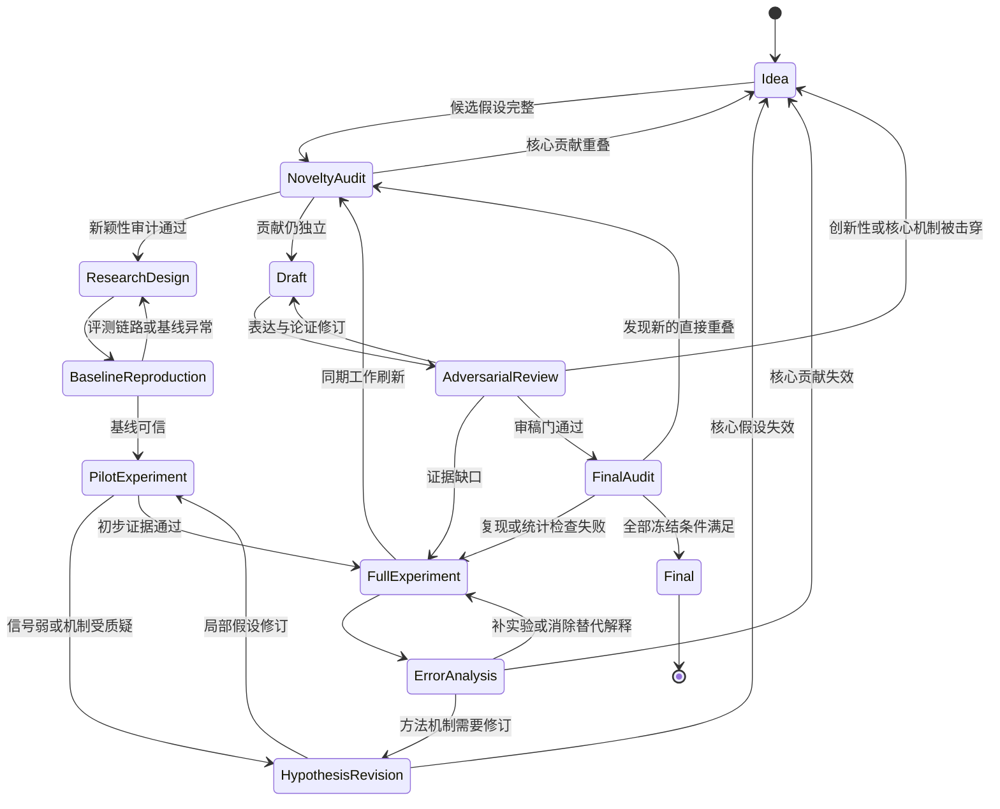

# 全自动科研开发规范

> 适用方向：Agent Memory  
> 目标：构建能够自主完成 Idea 生成、重复性调查、正式研究、实验迭代、论文初稿、对抗审稿与终稿冻结的全自动科研 Agent。  
> 文档性质：项目级强制规范。任何研究 Agent、代码 Agent、实验 Agent 和写作 Agent 均以本规范作为最高层执行约束之一。

---

## 1. 项目目标

本系统面向完整科研闭环，而非论文文本生成。系统的核心产物包括研究问题、可证伪假设、相关工作地图、方法实现、可复现实验、失败记录、证据链、论文正文以及最终可审计研究包。

默认研究方向为 Agent Memory。研究主题可以落在记忆写入、组织、检索、更新、遗忘、纠错、共享、迁移、长期运行、可信性、多 Agent 协同以及科研 Agent 自身记忆等子问题，但每一个具体 Idea 都必须重新经过新颖性审计。领域方向本身不构成创新性证明。

系统遵循以下总流程：

`Idea → Novelty Audit → Research → Test → Research/Test Loop → Draft → Adversarial Review → Final`

任何阶段发现核心贡献已被同期工作覆盖、核心假设失效、实验结论无法复现或证据不足时，状态机直接回滚。回滚属于正常科研行为，系统不得为了保留已经投入的工作量而维护失效 Idea。

---

## 2. 核心原则

### 2.1 Idea 只是候选

Idea 阶段只产生待检验研究假设。自然语言上听起来新颖、方法结构复杂、使用了新的模型名称，都不构成研究贡献。

一个合格候选必须至少包含四个元素：

`Problem + Mechanism + Falsifiable Hypothesis + Killer Experiment`

其中：

1. `Problem` 描述当前研究对象中确切存在的缺口或失败现象。
2. `Mechanism` 描述系统准备引入的关键机制。
3. `Falsifiable Hypothesis` 给出能够被实验推翻的明确命题。
4. `Killer Experiment` 是成本最低、最容易直接击穿核心假设的实验。

缺少其中任何一项时，候选保持 `IDEA_INCOMPLETE` 状态，不进入新颖性审计。

### 2.2 先否证，再扩展

实验顺序优先寻找失败证据。系统先运行最便宜、最直接的反证实验，再决定是否投入完整实验预算。

如果一个机制需要依赖大量超参数搜索、多个特殊数据处理步骤或复杂提示词才能首次获得微弱正向结果，系统将其标记为 `FRAGILE_SIGNAL`，随后进入专门的稳健性检查。

### 2.3 证据约束论文

论文中的核心事实、数值、效果描述和贡献判断必须绑定到具体证据。写作 Agent 仅从已经进入 Claim Ledger 的结论生成正文。

基本链路固定为：

`Claim → Figure/Table → Experiment Run → Config → Code Commit → Raw Result`

其中任何一环失效时，关联 Claim 自动转为 `STALE`，写作 Agent需要重新获取有效证据。

### 2.4 允许彻底回滚

系统保存 sunk cost，但不服从 sunk cost。代码量、实验费用、已写章节和运行时间都不改变科研判断。

当 Prior-Art Auditor 判定核心贡献重叠，或 Red-Team Reviewer 击穿核心假设时，Research Director 可以直接执行：

`KILL_IDEA → ARCHIVE → UPDATE_DEAD_IDEA_MEMORY → GENERATE_NEW_IDEA`

### 2.5 全流程可审计

每次重要决策都需要保留输入、输出、依据、时间、模型配置和关联资产。研究过程最终可以回答以下问题：

1. 为什么选择这个 Idea。
2. 搜过哪些相关工作。
3. 哪些 Idea 被淘汰，原因是什么。
4. 当前 Claim 来自哪个实验。
5. 实验使用哪一版代码和配置。
6. 哪些失败实验影响了后续设计。
7. 初稿到终稿之间修改了哪些研究结论。

---

## 3. 全局状态机



Research Director 只按照状态机允许的边执行迁移。Agent 无权通过修改状态名称绕过 Gate。

---

## 4. Agent 角色与权限

系统采用多 Agent 分工。Research Director 负责调度和状态，不直接垄断研究判断。

| Agent | 主要职责 | 关键产物 | 权限 |
|---|---|---|---|
| Research Director | 状态机、预算、任务分发、冻结 | `RESEARCH_STATE` | 全局调度 |
| Ideator | 生成和修改候选 Idea | `Idea Card` | 提案 |
| Literature Scout | 检索论文、代码、基准与引用网络 | `Literature Map` | 检索 |
| Prior-Art Auditor | 独立判断贡献重叠 | `Novelty Report` | 可否决 Idea |
| Methodologist | 方法设计、假设拆解、消融规划 | `Claim Contract` | 研究设计 |
| Baseline Engineer | 复现强基线与评测环境 | `Baseline Attestation` | 基线冻结 |
| Experimenter | 实现、运行、记录实验 | `Run Artifacts` | 实验执行 |
| Statistician | 统计检验、置信区间、稳健性分析 | `Statistics Report` | 统计审计 |
| Error Analyst | 失败样本、替代解释、机制诊断 | `Error Taxonomy` | 触发补实验 |
| Red-Team Reviewer | 主动寻找论文致命缺口 | `Attack Report` | 可触发回滚 |
| Writer | 基于 Claim Ledger 写稿 | `Manuscript` | 仅写已绑定证据 |
| Reproducibility Auditor | 检查代码、配置、随机种子和资产 | `Reproduction Report` | 可阻止终稿冻结 |
| Artifact Auditor | 检查最终交付物完整性 | `Final Checklist` | Final Gate |

Prior-Art Auditor 和 Red-Team Reviewer 保持独立上下文。二者读取必要研究资产，但不得直接继承 Ideator 对 Idea 的正面解释，以降低确认偏差。

---

## 5. 研究记忆系统

科研 Agent 自身必须拥有持久研究记忆。聊天历史仅作为临时交互记录，正式研究状态以结构化研究记忆为准。

### 5.1 Literature Memory

保存论文、预印本、代码仓库、基准、引用关系和主要结论。每条记录至少包含：

`paper_id / title / date / venue / problem / mechanism / setting / claims / datasets / baselines / limitations / code / relation_to_ours`

同一论文的摘要、正文结论和系统自行推断的内容分开存储，避免把推断误写成作者原结论。

### 5.2 Dead Idea Memory

所有被淘汰的 Idea 永久记录。至少包含：

`idea_id / original_claim / kill_stage / kill_reason / conflicting_work / failed_experiment / reusable_assets / lessons`

新一轮 Idea 生成前，Ideator 必须先读取 Dead Idea Memory。与历史死亡 Idea 高度相似的候选进入 `REPEAT_WARNING`，需要给出新增证据后才可继续。

### 5.3 Experiment Memory

保存每一次正式运行的可重建信息：

`run_id / hypothesis_id / commit / config_hash / model / dataset_version / seed / prompt_version / tool_version / raw_output / metrics / cost / status`

试跑、调试和正式实验使用不同状态。只有 `FROZEN_RUN` 可以进入主表和论文正文。

### 5.4 Claim Memory

Claim Memory 是论文事实的唯一入口。每条 Claim 至少包含：

`claim_id / statement / type / supporting_runs / contradicting_runs / scope / confidence_state / manuscript_refs`

`confidence_state` 采用离散状态：

`UNVERIFIED / SUPPORTED / CHALLENGED / STALE / REJECTED / FROZEN`

其中 `FROZEN` 仅在统计、复现和范围审计均通过后产生。

### 5.5 Decision Memory

记录重要研究决策及其依据，例如删除某模块、调整任务范围、增加控制变量、替换 baseline。后续 Agent 可以追溯当时为什么做出该选择，减少研究过程中重复争论和隐性漂移。

---

## 6. Idea 生成规范

### 6.1 先构建问题地图

进入一个新方向时，Literature Scout 先生成领域问题地图。Agent Memory 默认至少覆盖以下轴：

1. 写入：什么信息进入记忆，写入时如何压缩和筛选。
2. 表示：文本、结构化记录、图、程序、轨迹、参数化记忆等。
3. 检索：相似度、因果价值、任务条件、时间条件和主动检索策略。
4. 更新：冲突信息、环境变化、旧记忆退化和版本管理。
5. 遗忘：容量控制、过时信息、干扰和主动删除。
6. 可信性：错误记忆、污染、来源、证据和可追溯性。
7. 使用：记忆怎样改变规划、推理、行动和工具调用。
8. 泛化：跨任务、跨环境、跨模型和跨 Agent 的迁移。
9. 协同：多 Agent 的共享、隔离、权限和一致性。
10. 长期运行：数百到数千轮交互后的累积效应。
11. 科研 Agent Memory：文献、失败 Idea、实验和 Claim 的长期管理。

问题地图只用于发现候选空位，不代表这些空位天然具有研究价值。

### 6.2 Idea Card

每个候选 Idea 单独建立 Idea Card：

```text
Idea ID:
Problem:
Observed Failure:
Target Setting:
Mechanism:
H1:
H2:
Expected Contribution:
Strongest Known Neighbor:
Why Existing Work Is Insufficient:
Killer Experiment:
Kill Condition:
Minimum Evidence Required:
Estimated Cost:
```

其中 `Why Existing Work Is Insufficient` 需要引用具体 prior art 差异，禁止只写“现有工作关注不足”。

### 6.3 候选池机制

Ideator 每轮生成多个候选，Prior-Art Auditor 独立处理。候选池允许全部淘汰。

系统不设置“本轮必须保留一个 Idea”的约束。连续多轮无候选通过时，Research Director 扩展问题地图或更换研究切入点，而不是降低新颖性门槛。

---

## 7. Novelty Audit 规范

Novelty Audit 属于硬 Gate。

### 7.1 检索范围

对每个 Idea 至少执行以下检索：

1. Problem 同义词。
2. Mechanism 同义词。
3. Problem 与 Mechanism 组合。
4. 目标 benchmark 与现象名称。
5. 关键假设的自然语言表达。
6. 近邻论文的引用和被引网络。
7. 最近预印本和近期会议论文。
8. 公开代码仓库和 benchmark leaderboard。
9. 与目标方法相邻的其他术语体系。

检索日志需要保存查询词、数据源、日期和结果快照。

### 7.2 Prior-Art Matrix

每个高相关工作进入矩阵：

| Work | Problem | Mechanism | Setting | Main Claim | Evaluation | Relation |
|---|---|---|---|---|---|---|
| Prior A |  |  |  |  |  |  |
| Prior B |  |  |  |  |  |  |
| Ours |  |  |  |  |  |  |

`Relation` 仅使用明确关系描述，例如：

`DIRECT_OVERLAP / PARTIAL_OVERLAP / SAME_PROBLEM_DIFFERENT_MECHANISM / SAME_MECHANISM_DIFFERENT_PROBLEM / COMPLEMENTARY / DISTANT`

### 7.3 Kill 条件

出现以下任一情况时，Idea 进入 `KILLED_BY_PRIOR_ART`：

1. 已有工作覆盖相同核心问题、相同关键机制和相近实验 claim。
2. 差异主要来自换模型、换数据集、换 prompt 或新增工程模块。
3. 核心贡献只是在已有方法上增加常规组合，缺少独立机制命题。
4. 最关键实验已经被已有工作完成，并且新方案缺少新的可证伪问题。
5. Idea 的主要价值依赖对相关工作的误读。

边界型情况进入 `NOVELTY_REVIEW_REQUIRED`，由第二个独立 Auditor 再审一次。

### 7.4 Novelty Freeze

通过 Gate 后生成 `NOVELTY_FREEZE.md`，记录：

1. 截止日期。
2. 检索范围。
3. 最近邻工作。
4. 明确差异。
5. 当前研究 Claim。
6. 未来需要重点监控的关键词。

完整实验结束和终稿前各刷新一次。

---

## 8. Claim Contract

Novelty Audit 通过后，在正式实现前冻结 Claim Contract。

Claim Contract 包含三类内容。

### 8.1 主假设

建议控制在两到四条。例如：

`H1`：目标现象在给定任务条件下稳定存在。  
`H2`：提出的机制直接缓解该现象。  
`H3`：效果跨模型或任务保持。  
`H4`：改进并非依赖额外上下文、额外调用次数或更高成本。

每条 H 都要绑定证伪条件。

### 8.2 范围

明确语言、任务、模型、数据分布和时间范围。论文只在证据覆盖范围内表达结论。

### 8.3 Kill Contract

提前规定研究终止条件。例如核心 effect 在预注册试验中消失、机制消融与完整方法无差异、Oracle 对照证明问题定义错误、主要提升完全由预算差异解释。

Kill Contract 在结果出来后保持原文，Research Director 不根据结果重新解释门槛。

---

## 9. 基线复现规范

正式比较前先复现最强相关 baseline。

Baseline Engineer 需要输出 `BASELINE_ATTESTATION.md`，包含：

1. 官方代码和版本。
2. 数据版本。
3. 环境。
4. 配置。
5. 官方报告指标。
6. 本地复现指标。
7. 差异解释。
8. 尚未对齐的部分。

存在明显复现偏差时，主实验保持锁定。系统先解决评测链路和配置问题。

比较分为两类：

`Matched Setting`：相同 backbone、预算、工具、上下文和输出限制，用于判断机制贡献。

`Best Available Setting`：各系统采用公开推荐配置，用于判断实际系统效果。

论文中分别报告，避免把模型能力差异误归因于框架。

---

## 10. Pilot 与 Killer Experiment

### 10.1 目的

Pilot 只回答两个问题：

1. 研究现象是否存在。
2. 核心机制是否值得继续投入。

Pilot 不承担完整论文证明任务。

### 10.2 实验规模

优先选择小样本、低调用成本、少模型的设计。实验条件中加入能够击穿假设的控制组，例如：

1. Memory Off。
2. 随机 Memory。
3. 相关但错误 Memory。
4. 正确但无关 Memory。
5. Oracle Memory。
6. 相同 token 预算的非记忆上下文。
7. 随机选择或简单规则 baseline。

具体控制组依据 Claim Contract 选择。

### 10.3 Pilot 决策

Pilot 输出进入以下状态之一：

`PROMISING`：存在稳定信号，进入完整实验。  
`MECHANISM_UNCLEAR`：现象存在，机制解释不足，进入 Hypothesis Revision。  
`FRAGILE_SIGNAL`：结果强依赖少量设置，增加稳健性检查。  
`HYPOTHESIS_REJECTED`：核心假设失效，回到 Idea。  
`EVALUATION_INVALID`：评测链路存在问题，回到 Research Design。

---

## 11. 正式实验规范

正式实验以 Research Question 驱动。默认结构如下，具体数量依据论文问题调整。

### RQ1：总体有效性

回答方法在目标任务上是否取得稳定改进。包含强基线、统一预算、主要指标和统计区间。

### RQ2：机制归因

通过模块消融、替代机制、Oracle 对照和干预实验说明改进来自提出的核心机制。

### RQ3：泛化与边界

检查跨模型、跨任务、跨数据规模、跨记忆长度、跨环境变化等条件。这里只覆盖论文声称的泛化范围。

### RQ4：成本与实际效用

报告 token、模型调用次数、延迟、存储、额外工具调用和单位成功成本。长期记忆方法还需要报告记忆增长速度以及检索开销。

每个 RQ 对应独立实验表和冻结配置。

---

## 12. Research/Test 循环

正式研究阶段采用循环：

`Experiment → Error Analysis → Hypothesis Update → Targeted Experiment`

Error Analyst 每轮至少检查：

1. 提升是否来自额外上下文。
2. 提升是否来自更强 backbone。
3. 提升是否来自更多调用预算。
4. benchmark 是否对方法结构存在特殊偏好。
5. Judge 是否受输出格式影响。
6. 数据是否存在泄漏或未来信息。
7. 单一任务是否贡献了大部分平均提升。
8. 极少数异常样本是否主导统计结果。
9. Memory 本身是否引入新的错误类型。
10. 同一实验重复运行后结论是否稳定。

发现替代解释后，Experimenter设计最小干预实验。优先消掉最能推翻主 Claim 的解释。

---

## 13. 实验冻结与数据治理

每个正式实验运行生成唯一 `run_id`。任何主结果必须满足：

1. 代码 commit 已冻结。
2. 配置哈希已记录。
3. 数据版本已记录。
4. prompt 和模型版本已记录。
5. 随机种子已记录。
6. 原始输出完整保存。
7. 指标脚本版本已记录。
8. 费用和调用次数已记录。
9. 日志可以重建。
10. 运行状态为 `FROZEN_RUN`。

重新运行产生新 `run_id`，覆盖旧文件不构成合法实验更新。

---

## 14. 统计规范

Statistician 在 Writer 获取结果前完成统计审计。

至少关注：

1. 配对实验优先采用配对统计。
2. 数据具有项目、用户、任务等层级结构时，按真实独立单位聚类。
3. 报告 effect size 和置信区间。
4. 多次随机运行保留完整分布。
5. 主指标提前确定。
6. 大量探索性比较与正式确认性结论分开记录。
7. 对异常值处理保留原始版本和处理依据。
8. 平均值之外同步检查分位数、失败率和样本级分布。

统计结论进入 Claim Memory 后才能写入主论文。

---

## 15. 对抗审稿规范

Draft 前后均运行 Red-Team Review。Reviewer 的目标是寻找足以降低论文可信度的证据。

至少包含五个独立视角：

1. Novelty Reviewer：寻找直接 prior art 和同期工作。
2. Method Reviewer：检查机制是否真正独立。
3. Experiment Reviewer：检查控制变量、baseline 和替代解释。
4. Statistics Reviewer：检查统计单位、波动和显著性。
5. Reproducibility Reviewer：检查环境、配置和资产完整性。

Reviewer 独立输出问题，再由 Research Director 合并。

问题分级：

`P0`：核心贡献、核心假设、数据泄漏、评测失效、直接 prior art。触发回滚。  
`P1`：需要新增实验或实质方法修订。返回 Full Experiment。  
`P2`：论证、表述、图表或局部分析问题。返回 Draft。  
`P3`：格式和非实质性问题。进入 Final Polish。

P0 在 Final Gate 前必须清零。

---

## 16. 写作规范

### 16.1 写作起点

正式写作从冻结图表和 Claim Ledger 开始，而非从 Introduction 开始。

推荐顺序：

`Results → Method → Experimental Setup → Introduction → Related Work → Abstract`

该顺序让论文叙述由真实证据反向约束。

### 16.2 Claim Binding

Writer 写入以下内容前必须查询 Claim Memory：

1. 性能提升。
2. 机制有效性。
3. 泛化结论。
4. 成本结论。
5. 与 baseline 的比较。
6. “首次”“新颖”“现有工作缺少”等相关工作判断。

找不到 `SUPPORTED` 或 `FROZEN` Claim 时，该句保持 `EVIDENCE_REQUIRED` 标记。

### 16.3 论文贡献

贡献段只描述已经得到证据的内容。禁止在贡献段使用尚未验证的宏大目标替代实验结论。

### 16.4 Related Work

Related Work 直接从 Prior-Art Matrix 生成初稿，再由 Literature Scout 检查上下文。每篇关键近邻工作都需要准确区分 Problem、Mechanism 和 Setting。

---

## 17. Final Audit

进入终稿前重新执行一次完整 Novelty Audit。检索截止日期写入论文审计记录。

Final Audit 同时检查：

1. 所有主表来自 Frozen Run。
2. 所有 Claim 具有证据绑定。
3. 所有图表可以由脚本重建。
4. 所有主结果完成独立复现。
5. 代码与配置版本已经冻结。
6. Related Work 已刷新。
7. P0 与 P1 问题全部处理。
8. Limitations 与真实边界一致。
9. 摘要中的数字与正文完全一致。
10. 最终研究包具有完整 provenance。

全部通过后状态转为 `FINAL_FROZEN`。

---

## 18. 目录规范

项目根目录建议采用以下结构：

```text
research-agent/
├── README.md
├── RESEARCH_STATE.json
├── CHANGE_HISTORY.md
├── config/
├── agents/
│   ├── director/
│   ├── ideator/
│   ├── literature/
│   ├── prior_art/
│   ├── methodologist/
│   ├── experimenter/
│   ├── statistician/
│   ├── red_team/
│   └── writer/
├── memory/
│   ├── literature/
│   ├── dead_ideas/
│   ├── experiments/
│   ├── claims/
│   └── decisions/
├── ideas/
│   ├── candidates/
│   ├── killed/
│   └── frozen/
├── novelty/
│   ├── searches/
│   ├── prior_art_matrix/
│   └── freezes/
├── research/
│   ├── claim_contract/
│   ├── method/
│   └── baselines/
├── experiments/
│   ├── pilot/
│   ├── full/
│   ├── ablation/
│   ├── robustness/
│   └── error_analysis/
├── results/
│   ├── raw/
│   ├── processed/
│   ├── tables/
│   └── figures/
├── reviews/
│   ├── novelty/
│   ├── red_team/
│   ├── statistics/
│   └── reproducibility/
├── manuscript/
│   ├── draft/
│   ├── figures/
│   ├── tables/
│   └── final/
└── artifacts/
    ├── logs/
    ├── manifests/
    └── final_package/
```

大型原始数据可以存储在外部对象存储或数据仓库中，仓库内保留 manifest、hash、下载方式和版本说明。

---

## 19. RESEARCH_STATE 规范

`RESEARCH_STATE.json` 是全系统的单一状态源，至少包含：

```text
project_id
research_direction
current_state
active_idea_id
novelty_freeze_id
claim_contract_id
active_rqs
active_commit
dataset_versions
baseline_status
pilot_status
full_experiment_status
open_p0
open_p1
manuscript_version
last_novelty_refresh
budget_used
budget_remaining
updated_at
```

状态修改通过 Research Director 完成。其他 Agent 只能提交状态迁移请求和证据。

每次迁移同时写入 `CHANGE_HISTORY.md`。

---

## 20. 预算管理

系统需要同时管理模型调用预算、计算预算和时间预算。

Research Director 采用分阶段解锁：

1. Idea 和 Novelty Audit 使用低成本预算。
2. 通过 Novelty Gate 后解锁 baseline 复现预算。
3. Pilot 成功后解锁完整实验预算。
4. 主 Claim 得到初步支持后解锁大规模稳健性实验。
5. Draft 通过内部审稿后解锁最终复现预算。

高成本实验开始前必须明确它将验证哪条 Claim。无法绑定 Claim 的实验进入探索队列，不占用正式实验预算。

---

## 21. 同期工作监控

研究执行期间持续维护关键词集合，包括：

`problem terms / mechanism terms / benchmark names / closest papers / author groups / code repositories`

监控结果进入 Literature Memory。

触发以下事件时重新运行 Novelty Audit：

1. 完整实验开始前。
2. 完整实验结束后。
3. 初稿完成后。
4. 终稿冻结前。
5. 出现高度相关新论文时。

发现直接重叠后，Research Director 重新评估核心 Claim。可以缩小研究范围、转向尚未解决的机制问题，或直接回到 Idea。

---

## 22. 失败处理规范

失败实验属于正式研究资产。

每个失败至少记录：

`Expectation / Observation / Diagnosis / Evidence / Decision / Reusable Asset`

系统区分：

`IMPLEMENTATION_FAILURE`：实现或环境问题。  
`EVALUATION_FAILURE`：评测方法失效。  
`HYPOTHESIS_FAILURE`：科学假设被反证。  
`NOVELTY_FAILURE`：同期工作覆盖。  
`RESOURCE_FAILURE`：资源不足影响执行。  
`REPRODUCIBILITY_FAILURE`：结果无法稳定重建。

其中 Hypothesis Failure 和 Novelty Failure 优先进入 Dead Idea Memory，后续 Idea 生成必须检索。

---

## 23. Agent Memory 方向的专项要求

Agent Memory 研究容易把“增加更多上下文”误认为“记忆机制有效”。本项目增加以下专项控制：

1. 所有主实验至少包含等 token 的非记忆上下文对照。
2. 报告 Memory 写入和检索的额外成本。
3. 区分 stored information、retrieved information 和 actually used information。
4. 记录错误记忆进入决策链后的传播过程。
5. 长期实验检查记忆增长、陈旧信息和干扰。
6. 评估 memory policy 对行动或推理的真实改变，而非只评估检索相似度。
7. 涉及记忆更新时保存版本和来源。
8. 多 Agent 共享记忆时显式记录读写权限和信息传播路径。
9. 研究未来任务触发、长期意图、失败经验、因果价值等热门主题时，Novelty Audit 使用更严格的近期预印本检索。
10. 新系统若只改变记忆数据库结构，而未提出新的行为机制或可证伪现象，保持工程项目状态，不进入论文主线。

---

## 24. 自动执行主循环

Research Director 的逻辑流程固定如下：

```text
while project_status != FINAL_FROZEN:

    generate_candidate_ideas()

    for idea in candidate_pool:
        run_novelty_audit(idea)

        if idea overlaps with prior art:
            archive_dead_idea(idea)
            continue

        freeze_claim_contract(idea)
        reproduce_baselines()

        if baseline_attestation fails:
            repair_evaluation_pipeline()
            continue

        run_killer_experiment()

        if core_hypothesis fails:
            archive_dead_idea(idea)
            continue

        while evidence is incomplete:
            run_targeted_experiment()
            perform_error_analysis()
            perform_red_team_attack()

            if core_claim collapses:
                archive_dead_idea(idea)
                break

        if core_claim survives:
            refresh_novelty_audit()

        if novelty still holds:
            freeze_main_results()
            write_draft_from_claim_ledger()
            run_adversarial_review()

        if review requires new evidence:
            return to experiments

        if review invalidates contribution:
            return to idea generation

        run_final_audit()

        if final audit passes:
            freeze_final_package()
```

实现时可以使用工作流引擎、消息队列或持久状态机，但语义必须与上述状态迁移保持一致。

---

## 25. 最小开发里程碑

### M0：状态机骨架

实现 Research Director、`RESEARCH_STATE`、任务调度、日志和状态迁移。此阶段用模拟 Agent 验证回滚链路。

完成标准：每条允许边均可执行，非法迁移会被拒绝，状态变化具有日志。

### M1：Idea 与 Novelty 闭环

实现 Ideator、Literature Scout、Prior-Art Auditor、Dead Idea Memory 和 Prior-Art Matrix。

完成标准：系统能够连续生成候选、检索、淘汰、记录原因，再自动产生下一轮候选。

### M2：实验闭环

实现 Claim Contract、Baseline Attestation、Pilot、正式实验、Error Analysis 和 Frozen Run。

完成标准：一个小型研究问题可以从假设进入实验，并依据结果自动继续、修订或淘汰。

### M3：证据系统

实现 Claim Ledger 和完整 provenance。

完成标准：任意论文核心结论都可以追溯到 raw result、配置和 commit。

### M4：自动写作与审稿

接入 Writer 和独立 Reviewer。

完成标准：Writer 只能消费已绑定 Claim，Reviewer 可以触发补实验和回滚。

### M5：完整 Agent Memory Research Run

选择 Agent Memory 中一个新候选问题，从 Idea 开始全流程运行。

完成标准：系统在无人修改研究结论的情况下完成候选淘汰、研究、实验、初稿和终稿审计，并保留完整研究资产。

---

## 26. Definition of Done

### Idea 阶段完成

存在完整 Idea Card、Killer Experiment 和 Kill Condition。

### Novelty 阶段完成

存在检索日志、Prior-Art Matrix、独立 Auditor 结论和 Novelty Freeze。

### Research Design 完成

Claim Contract、RQ、baseline、数据、指标和证伪条件全部冻结。

### Pilot 完成

核心现象和机制获得初步验证，或 Idea 已正式淘汰。

### Full Experiment 完成

主 RQ、消融、稳健性、错误分析和成本实验形成冻结资产，关键结果通过统计审计。

### Draft 完成

所有主 Claim 已绑定证据，正文、图表和表格相互一致。

### Final 完成

最新 Novelty Audit、独立复现、Red-Team Review、Artifact Audit 全部通过，最终状态为 `FINAL_FROZEN`。

---

## 27. 项目红线

以下行为直接触发审计失败：

1. 为了保留 Idea 而主动降低新颖性标准。
2. 看到实验结果后重新定义主指标，并将新指标描述成预先设定。
3. 删除对主结论不利的有效实验。
4. 让 Writer 自行创造没有实验绑定的数值或结论。
5. 用更强模型或更高预算的优势替代方法贡献，却仍归因于框架。
6. baseline 复现明显异常时继续报告主比较结果。
7. 只保存聚合指标，缺少原始输出。
8. 同一个实验目录反复覆盖结果。
9. 只记录成功 Idea，不记录失败 Idea。
10. Prior-Art Auditor 与 Ideator 共用同一套未经隔离的推理结论。
11. 用论文写作质量掩盖机制证据缺口。
12. 在终稿前省略同期工作刷新。

---

## 28. 最终研究包

系统最终交付的不只有论文。完整研究包至少包含：

1. 最终论文。
2. Novelty Freeze 与最终 Novelty Refresh。
3. Prior-Art Matrix。
4. Dead Idea Registry。
5. Claim Contract。
6. Baseline Attestation。
7. 全部 Frozen Run manifest。
8. 原始实验结果。
9. 数据和配置版本。
10. 统计报告。
11. Error Analysis。
12. Red-Team Review。
13. Reproduction Report。
14. Claim Ledger。
15. CHANGE_HISTORY。
16. 最终代码 commit。
17. 可一键重建主表和主图的脚本或工作流。

最终评价标准只有一个：第三方拿到研究包后，可以理解系统为什么选择这个问题、为什么相信这些结论、哪些路线已经失败，以及怎样从原始结果重建论文中的关键证据。

---

## 29. 总结

全自动科研 Agent 的核心能力并非持续生成更多内容，而是持续做出可审计的研究决策。

系统先生成 Idea，再主动寻找能够杀死它的 prior art；通过新颖性审计后冻结 Claim Contract，用最低成本实验攻击核心假设；初步信号成立后进入完整实验，并通过 Error Analysis 与 Red-Team Review 持续消除替代解释。写作阶段只消费已经绑定的证据，终稿前重新检查同期工作、复现性与资产完整性。

对于 Agent Memory 方向，系统尤其重视长期记忆带来的干扰、陈旧信息、错误传播、额外上下文收益与真实机制收益之间的区分。最终目标是形成一条完整链路：

`Idea → Prior Art → Hypothesis → Experiment → Evidence → Claim → Paper`

链路中任何一环失效，状态机立即回滚。只有全部关键环节完成冻结和审计，项目才进入 `FINAL_FROZEN`。
